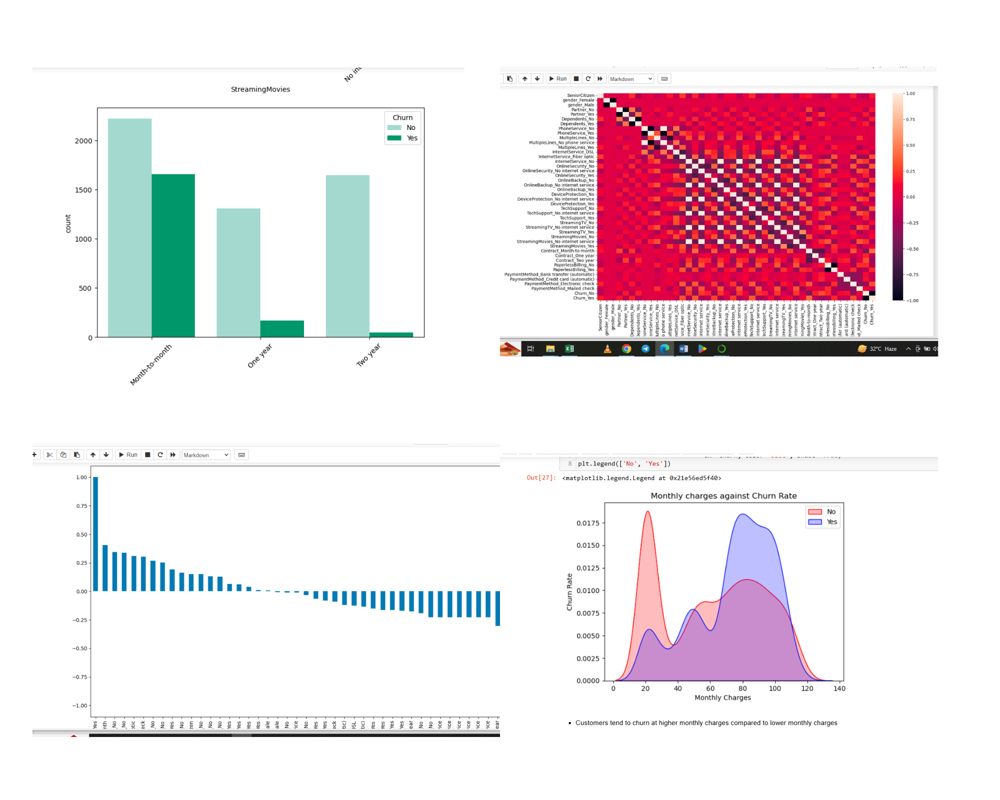

<!--Section 1: Introduce your self-->
## ABOUT ME

Hello! I'm Michael Frimpong, a data analyst and consultant passionate about leveraging data to drive impactful decisions. With experience in sales analytics, customer behavior insights, and operational efficiency, I help businesses unlock value through data-driven strategies.

<!--Mention your top/relevant skills here - core and soft skills-->
## WHAT I DO

*As a data professional with hands-on experience in analytics, reporting, and consulting, I offer tailored solutions for businesses and individuals.*

**- ✅ Predictive Modeling & Analysis.**
From understanding trends to predicting outcomes, I use advanced statistical models to provide actionable insights.

**- ✅ Staff Training & Development.**
I offer comprehensive training programs in data analysis, visualization, and data-driven decision-making. From beginner to advanced levels. 

**- ✅ Training and Mentorship.**
I design and deliver training programs on data tools like Python, SQL, and Power BI to empower teams and aspiring analysts.

<!--Section 2: List 3-4 key projects-->
## MY PROJECTS 

*A selection of projects that showcase my expertise.*

**Customer Churn Analysis and Prediction**

Designed and implemented a predictive model to identify customer churn using Python, Pandas, and Scikit-learn.

Visualized trends using Matplotlib and Seaborn, enabling actionable recommendations for retention strategies.

[Read More](https://github.com/mk-frimpong/Data-Analysis-/blob/main/Customer%20Churn%20Analysis.ipynb)

## SKILLS
- Python | SQL
- Power BI | Microsoft Excel | Data Entry
- Statistical Analysis | Data Visualization | Predictive Modeling

## CERTFICATIONS
- Data Analytics and Digital Transformation – Arizona State University
- Data Science (Python and MySQL) – Ghana Tech Lab
- Preparing Data for Impact Analysis – USAID

## CONTACT DETAILS

<table>
  <tbody>
    <tr>
      <td>📧</td>
      <td><a href="mailto:mickyfrimpong123@gmail.com">mickyfrimpong123@gmail.com</a></td>
    </tr>
    <tr>
      <td>📞</td>
      <td>(233) 59-121-3985</td>
    </tr>
    <tr>
      <td>📍</td>
      <td>Ghana</td>
    </tr>
    <tr>
    <td>🌐</td>
      <td><a href="https://www.linkedin.com/in/frimpong-michael-334514237"> LinkedIn Profile </a></td>
    </tr>
  </tbody>
</table>
